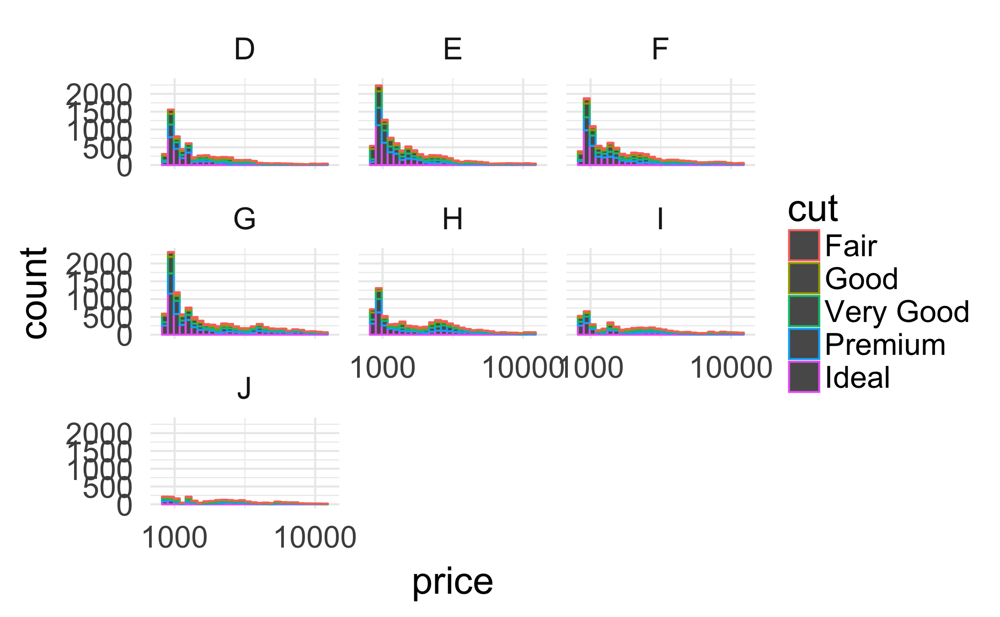
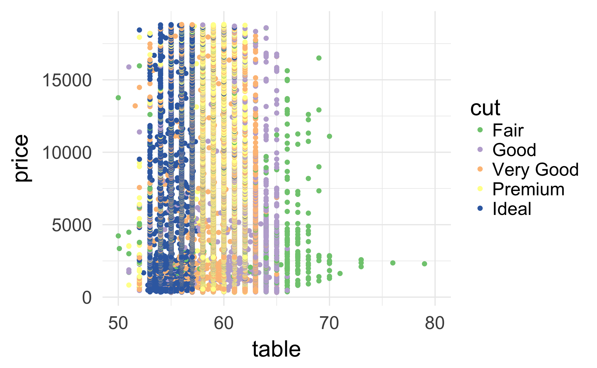
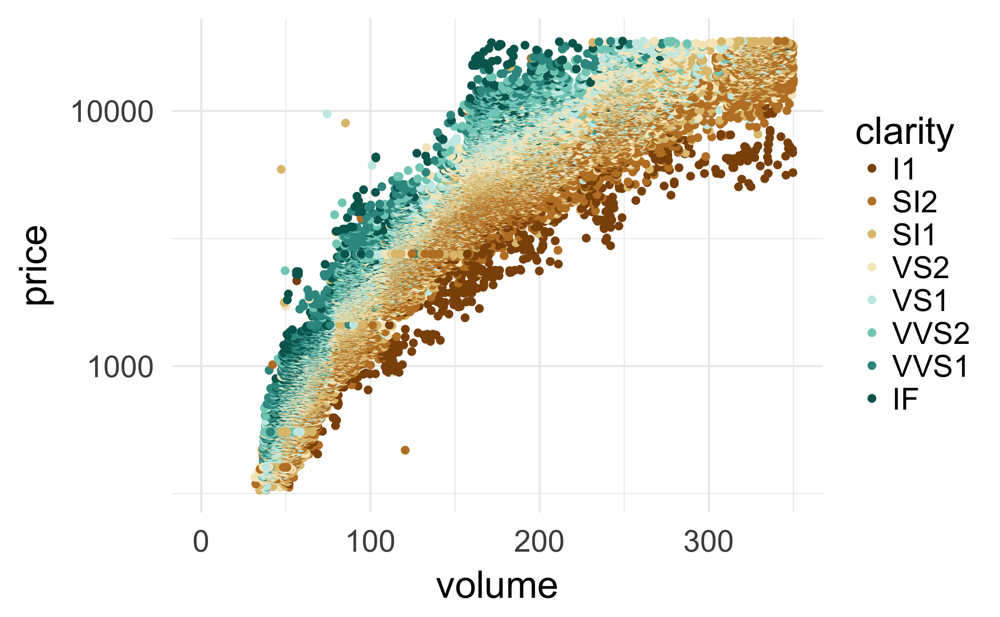
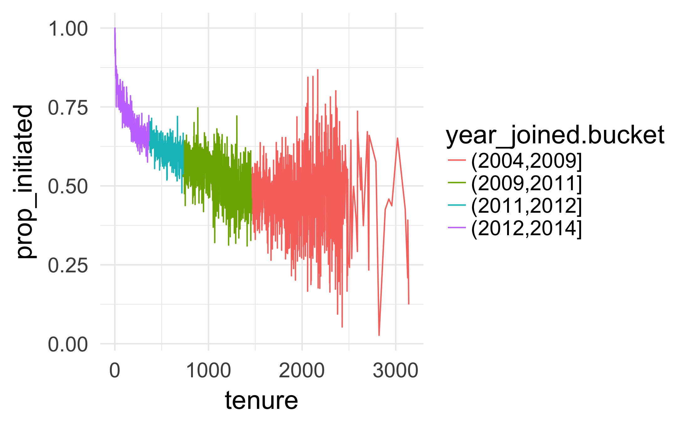
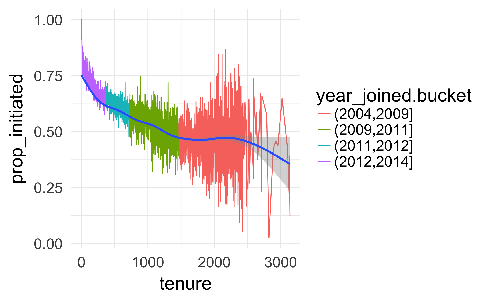
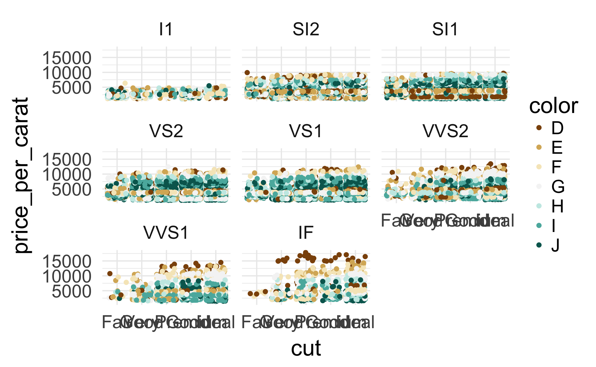

## 1、练习带有分面和颜色的价格直方图   

建立一个钻石价格的直方图，用不同颜色来表示不同的切工，并按照钻石颜色来分块表示

```{r}
# 加载钻石数据
data("diamonds")
summary(diamonds)
```

```{r}
ggplot(aes(x = price), data = diamonds) + 
  geom_histogram(aes(color = cut)) + 
  scale_fill_brewer(type = 'qual') + 
  scale_x_continuous(limits = c(0,11000), breaks = seq(1000,10000,9000)) + 
  facet_wrap(~color)
#ggsave("price_cut_color_count.png")
```


从上图中可以看出来，同一价格范围，颜色越好，占比越多，切工越好，占比越多。

## 2、练习价格与按切工填色的表格
分析价格与table的关系，并按cut来进行颜色划分
```{r}
ggplot(aes(x = table, y = price), data = diamonds) + 
  geom_point(aes(color = cut)) + 
  scale_color_brewer(type = 'qual') + 
  xlim(50,80)
#ggsave("table_price_divide_by_color.png")
```



## 3、练习典型表值
从上图可以看出，Ideal的典型表值是53~57，Premium的典型表值是58~62

## 4、练习价格与体积和钻石净度
1）创建price和volume的散点图
2、价格使用log10
3、用clarity对图形整体进行划分
4、去掉体积在前1%的值
```{r}
diamonds$volume <- with(diamonds, x*y*z)

ggplot(aes(x = volume, y = price), 
       data = subset(diamonds, volume <= max(volume)*0.99 & volume > 0)) + 
  geom_point(aes(color = clarity)) + 
  scale_color_brewer(type = 'div') + 
  scale_y_log10() + 
  xlim(0,350)

#ggsave("volume_price_divide_by_clarity.png")
```


## 5、练习新建友谊的比例

读取pseudo_facebook.tsv文件
```{r}
pf <- read.delim("pseudo_facebook.tsv")
```

创建新变量prop_initiated，记录用户主动发起好友占好友总数的比例
```{r}
pf$prop_initiated <- with(pf, friendships_initiated/friend_count)
```


## 6、练习 prop_initiated 与使用时长

创建一个median prop_initiated 和 tenure 的线性图，并用year_joined.bucket进行分段，每段用不同颜色表示

1)创建year_joined.bucket分组
```{r}
pf$year_joined <- with(pf, floor(2014 - tenure / 365))
table(pf$year_joined)
pf$year_joined.bucket <- with(pf, cut(year_joined, breaks = c(2004, 2009, 2011, 2012, 2014)))
table(pf$year_joined.bucket)
```

2）创建线性图
```{r}
ggplot(aes(x = tenure, y = prop_initiated), data = pf) + 
  geom_line(aes(color = year_joined.bucket), 
            stat = 'summary', 
            fun.y = median)
#ggsave("tenure_prop_initiated.png")
```


## 7、练习平滑化prop_initiated与使用时长
```{r}
ggplot(aes(x = tenure, y = prop_initiated), data = pf) + 
  geom_line(aes(color = year_joined.bucket), 
            stat = 'summary', 
            fun.y = median) + 
  geom_smooth()
#ggsave("tenure_prop_initiated_smooth.png")
```



## 9、练习最大的组均值prop_initiated
```{r}
with(subset(pf, prop_initiated >= 0), tapply(prop_initiated, year_joined.bucket, mean))
```
用上述方法计算可知，   
(2012,2014] ：0.6653892


## 10、练习经过分组、分面和填色的价格/克拉

1）先生成一个新的变量 price_per_carat 
```{r}
diamonds$price_per_carat <- with(diamonds, price/carat)
```

2) 创建散点图
```{r}
ggplot(aes(x = cut, y = price_per_carat), data = diamonds) + 
  geom_jitter(aes(color = color)) + 
  facet_wrap(~clarity) + 
  scale_color_brewer(type = 'div')

```




