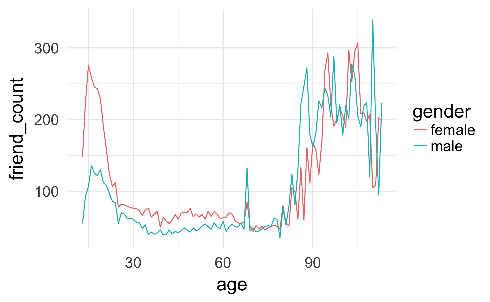
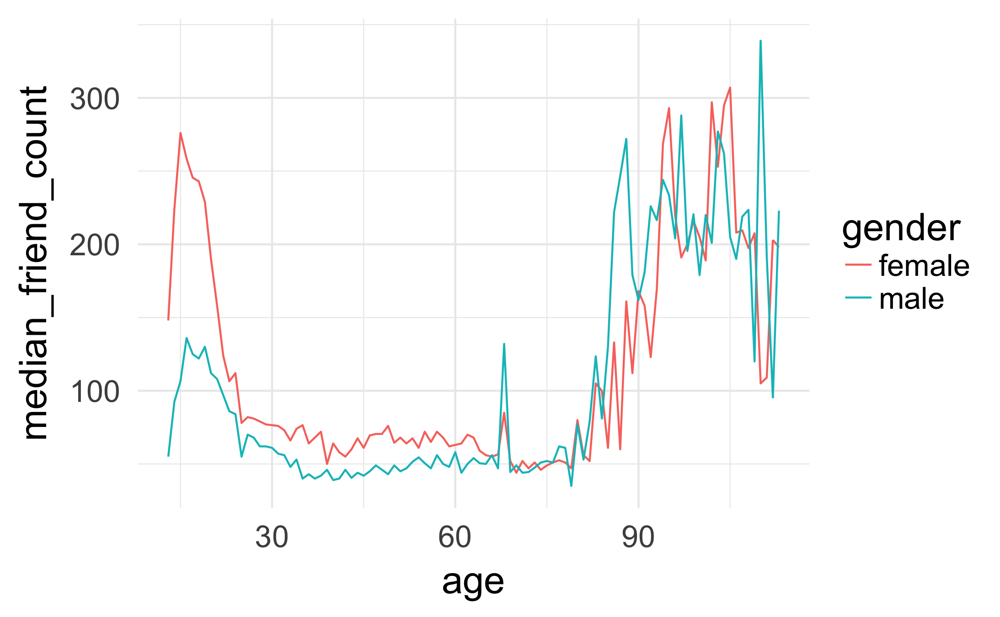
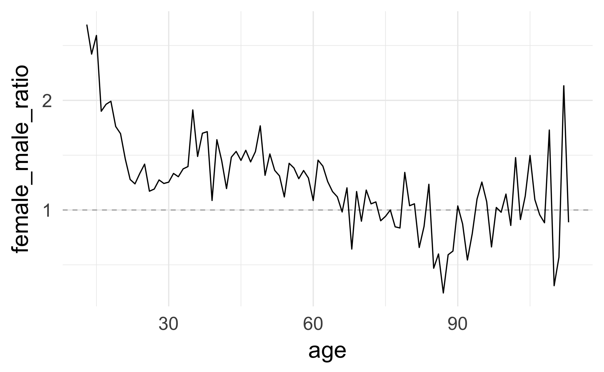
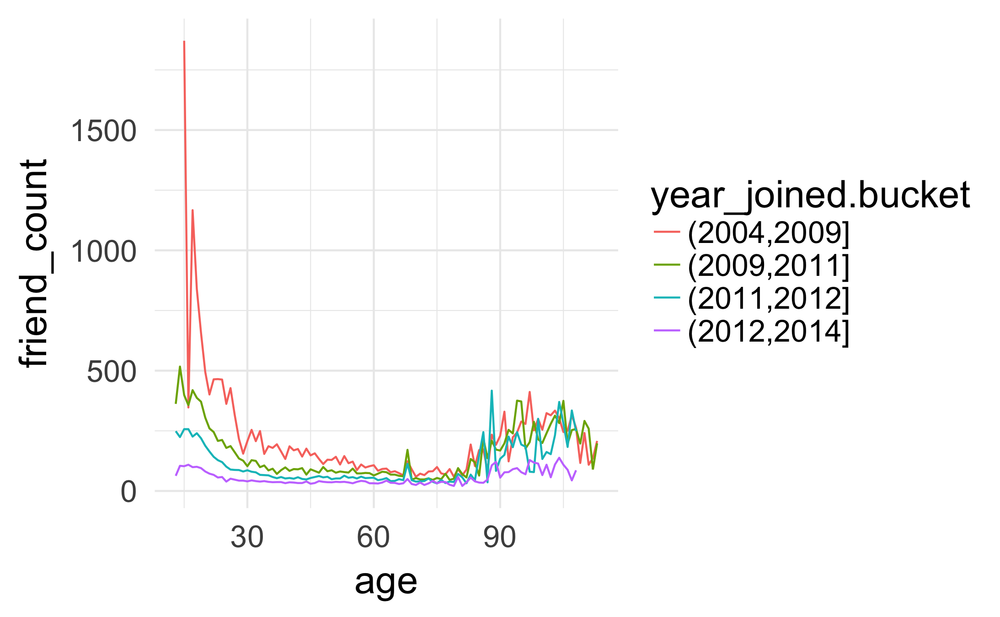
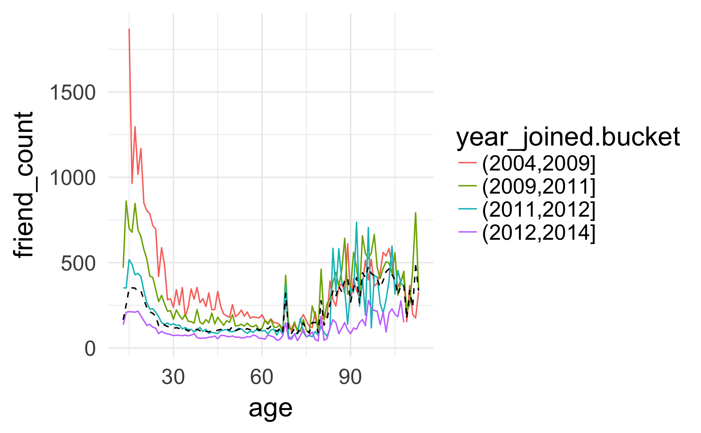
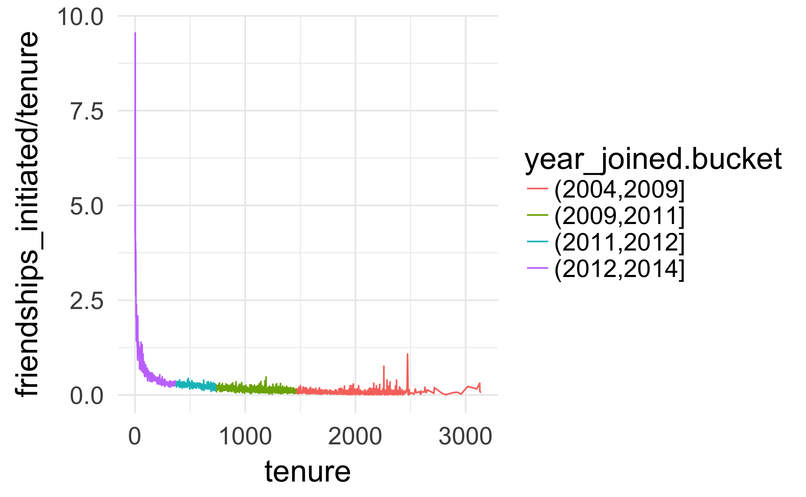
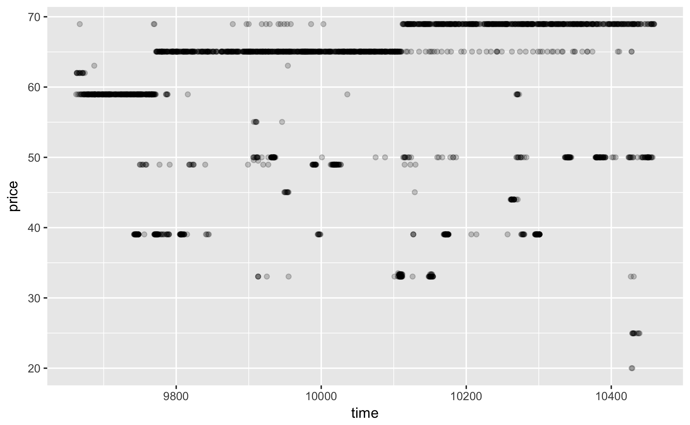
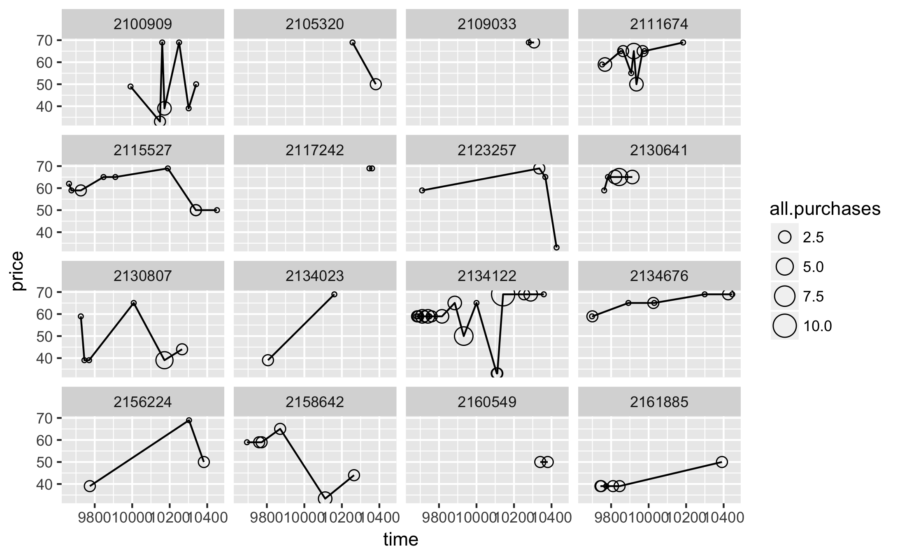
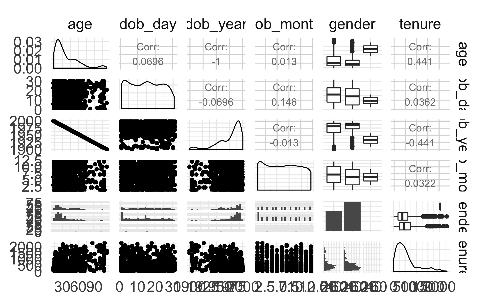
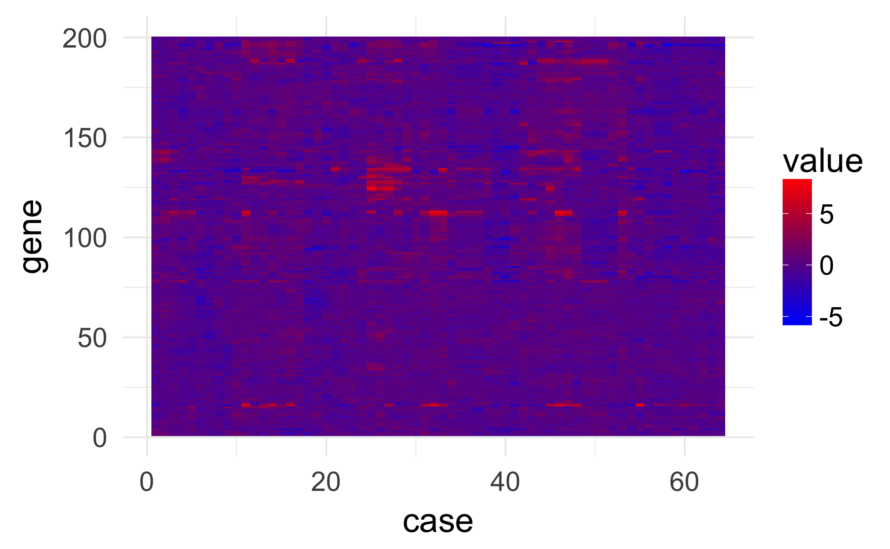

Lesson 5
========================================================
先查看在哪个文件夹中，使用getwd(),在使用setwd()设置到想要的文件夹中

### Multivariate Data
Notes:多变量数据，如何将一个变量添加到感知观众规模的散点图

***

### Moira Perceived Audience Size Colored by Age
Notes: 设想的受众规模-年龄
在散点图中增加了颜色来表示不同的年龄，是否可行？

***

### Third Qualitative Variable
Notes:第三个定性变量
我们试一下，看能否通过增加第三个变量，进一步研究好友数与年龄之间的关系
以前，我们注意到女性用户平均比男性用户有更多好友数，我们可能怀疑这只是因为女性用户有不同的年龄分布或者也许年龄条件实际差异很大
下面我们尝试将每个性别的平均值添加到箱线图中

```{r Third Qualitative Variable, echo=TRUE}
#读取数据，并存储到pf变量中
pf <- read.csv("pseudo_facebook.tsv", sep = '\t')
library(ggplot2)

ggplot(aes(x = gender, y = age), 
       data = subset(pf, !is.na(gender))) + 
  geom_boxplot() + 
  stat_summary(fun.y = mean, geom = 'point', shape = 4)

ggplot(aes(x = age, y = friend_count), 
       data = subset(pf, !is.na(gender))) + 
  geom_line(aes(color = gender), stat = 'summary', fun.y = median)
#ggsave("age_friend_count.png")
```


建议新的数据集 pf.fc_by_age_gender，将数据按照age和gender分组
```{r}
library(dplyr)
# 将函数链在一起 %>%

pf.fc_by_age_gender <- pf %>% 
  filter(!is.na(gender)) %>%
  group_by(age, gender) %>% 
  summarise(mean_friend_count = mean(friend_count), 
            median_friend_count = median(friend_count), 
            n = n()) %>%
  arrange(age)

head(pf.fc_by_age_gender)
tail(pf.fc_by_age_gender)
```
```{r}
# summarise将在运行时删除一层分组，所以我们要删除gender层，所以我们需要再一次运行分组，以删除年龄层
# filter函数过滤命令
pf.fc_by_age_gender1 <- pf %>% 
  filter(!is.na(gender)) %>%
  group_by(age, gender) %>% 
  summarise(mean_friend_count = mean(friend_count), 
            median_friend_count = median(friend_count), 
            n = n()) %>% 
  ungroup() %>%
  arrange(age)

head(pf.fc_by_age_gender1)
```


***

### Plotting Conditional Summaries
Notes: 使用新数据来画折线图

```{r Plotting Conditional Summaries}
ggplot(aes(x = age, y = median_friend_count), data = pf.fc_by_age_gender1) + 
  geom_line(aes(color = gender))
#ggsave("age_median_friend_count.png")
```

***

### Thinking in Ratios
Notes: 用比率思考，普通女性用户的好友数是男性用户好友数的多少倍？

***

### Wide and Long Format
Notes: 可以使用tidyr 包和 reshape2 包来重构数据。
根据上述建造的新数据 pf.fc_by_age_gender，同一年龄项会出现2个性别以及相对应的值，这里，需要将female和male放到同一行中，并用中位数表示female和male的值。
即把长数据调整成宽数据。

可以在以下链接中查看tider的用法：https://s3.amazonaws.com/udacity-hosted-downloads/ud651/DataWranglingWithR.pdf


以下是使用tidyr数据包的例子，先挑选出需要的列，再进行调整。
```{r}
#install.packages("tidyr")
library(tidyr)

pf.fc_by_age_gender_width <- spread(subset(pf.fc_by_age_gender, 
                                           select = c('gender', 'age', 'median_friend_count')), gender, median_friend_count)
```


***

### Reshaping Data

Notes:reshape2 入门，链接：http://www.seananderson.ca/2013/10/19/reshape.html

The following code uses dcast to reshape the data. This function is meant for data frames; if you are working with arrays or matrices, use acast instead.

reshape2: wide to long: melt()
long to wide: data frame: dcast();
long to wide: array or matrics: acast()

```{r}
#install.packages('reshape2')
library(reshape2)

pf.fc_by_age_gender.wide <- dcast(pf.fc_by_age_gender1, age ~ gender, value.var = "median_friend_count")

head(pf.fc_by_age_gender.wide)
tail(pf.fc_by_age_gender.wide)
```


***

### Ratio Plot
Notes: 比率图，使用比率图来分析男女所占的比例

```{r Ratio Plot}
pf.fc_by_age_gender.wide$female_male_ratio <- with(pf.fc_by_age_gender.wide, female / male)
ggplot(aes(x=age, y=female_male_ratio), data = pf.fc_by_age_gender.wide) + 
  geom_line() + 
  geom_hline(yintercept = 1, alpha = 0.3, linetype = 2)
#ggsave("age_female_male_ratio.png")
```

***

### Third Quantitative Variable
Notes: 练习第三个变量
tenure变量表示加入Facebook的天数

使用 floor() 函数向下舍入到最近的整数。你可以使用 ceiling() 函数向上舍入到最近的整数。

```{r Third Quantitative Variable}
pf$year_joined <- with(pf, 2014 - ceiling(tenure/365))
```

***

### Cut a Variable
Notes:切割一个变量

切割函数通常对于从连续或数值变量建立离散变量时非常有用，有时与分位数函数相结合。  <br />
下一个任务是切割加入年份变量,创建4个用户分组，分别是：<br />
2004~2009 <br />
2009~2011 <br />
2011~2012 <br />
2012~2014 <br />

查看cut函数：https://www.r-bloggers.com/r-function-of-the-day-cut-2/


```{r Cut a Variable, echo=TRUE}
summary(pf$year_joined)  #查看统计数据
table(pf$year_joined)  #查看不同年限加入的人数

pf$year_joined.bucket <- cut(pf$year_joined, breaks = c(2004, 2009, 2011, 2012, 2014))
```

***

### Plotting it All Together
Notes: 用 table(variable)可以查看该变量的结构

```{r}
ggplot(aes(x = age, y = friend_count), 
       data = subset(pf,!is.na(year_joined.bucket))) + 
  geom_line(aes(color = year_joined.bucket), 
            stat = 'summary', 
            fun.y = median)
#ggsave("age_year_joined_bucket.png")
```

***

### Plot the Grand Mean
Notes:

```{r Plot the Grand Mean}
ggplot(aes(x = age, y = friend_count), 
       data = subset(pf,!is.na(year_joined.bucket))) + 
  geom_line(aes(color = year_joined.bucket), 
            stat = 'summary', 
            fun.y = mean) + 
  geom_line(linetype = 2, 
            stat = 'summary', 
            fun.y = mean)
#ggsave("age_year_joined_bucket_full_median.png")
```

***

### Friending Rate
Notes:计算使用时间与好友数的比例，看到自从用户开始使用服务以来，他们每天有多少好友

```{r Friending Rate}
with(subset(pf, tenure >= 1), summary(friend_count / tenure))
```

***

### Friendships Initiated
Notes:

What is the median friend rate?
0.2205

What is the maximum friend rate?
0.2205


```{r Friendships Initiated}
ggplot(aes(x = tenure, y = friendships_initiated / tenure), 
       data = subset(pf, tenure >= 1)) + 
  geom_line(aes(color = year_joined.bucket), 
            stat = 'summary', 
            fun.y = mean)
#ggsave("tenure_friendships_initiated.png")
```

***

### Bias-Variance Tradeoff Revisited
Notes:

```{r Bias-Variance Tradeoff Revisited}

p1 <- ggplot(aes(x = tenure, y = friendships_initiated / tenure),
       data = subset(pf, tenure >= 1)) +
  geom_line(aes(color = year_joined.bucket),
            stat = 'summary',
            fun.y = mean)

p2 <- ggplot(aes(x = 7 * round(tenure / 7), y = friendships_initiated / tenure),
       data = subset(pf, tenure > 0)) +
  geom_line(aes(color = year_joined.bucket),
            stat = "summary",
            fun.y = mean)

p3 <- ggplot(aes(x = 30 * round(tenure / 30), y = friendships_initiated / tenure),
       data = subset(pf, tenure > 0)) +
  geom_line(aes(color = year_joined.bucket),
            stat = "summary",
            fun.y = mean)

p4 <- ggplot(aes(x = 90 * round(tenure / 90), y = friendships_initiated / tenure),
       data = subset(pf, tenure > 0)) +
  geom_line(aes(color = year_joined.bucket),
            stat = "summary",
            fun.y = mean)

library(gridExtra)
grid.arrange(p1,p2,p3,p4, ncol =1)

```

Instead of geom_line(), use geom_smooth() to add a smoother to the plot.

```{r}
ggplot(aes(x = tenure, y = friendships_initiated / tenure), 
       data = subset(pf, tenure > 0)) + 
  geom_smooth(aes(color = year_joined.bucket))
```

***

### Sean's NFL Fan Sentiment Study
Notes:

***

### Introducing the Yogurt Data Set
Notes:消费者需求的面板数据离散选择模型：http://www.nuff.ox.ac.uk/Economics/papers/2013/Panel%20Data%20Demand%20-%20June%2020,%202013.pdf

***

### Histograms Revisited
Notes:加载达能酸奶数据

```{r Histograms Revisited}
yo <- read.csv('yogurt.csv')

yo$id <- factor(yo$id)   #将ID变更为因子变量
str(yo)

ggplot(aes(x = price), data = yo) + 
  geom_histogram()

table(yo$price)
```
通过上面的分析，可以知道酸奶的价格并不连续

***

### Number of Purchases
Notes:通过一些统计数据来查看数据集   
需要弄清楚家庭在给定购买时机购买多少八盎司酸奶，解决这个问题的话，我们需要将不同酸奶口味的账户合并成一个变量
传递函数：

```{r Number of Purchases}
summary(yo)
length(unique(yo$price))
table(yo$price)

yo <- transform(yo, all.purchases = strawberry + 
                  blueberry + pina.colada + plain + 
                  mixed.berry)

summary(yo$all.purchases)
```

***

### Prices over Time
Notes: 建立一个价格和时间的散点图

```{r Prices over Time}
ggplot(aes(x = time, y = price), data = yo) + 
  geom_point(alpha = 1/5)
#ggsave("yo_price_over_time.png")
```


从上图中可以看出，酸奶价格随时间变化整体呈现上涨的趋势，但是有一些零散的点，应该是商家打折或者做促销时的价格。

***

### Sampling Observations
Notes:

***

### Looking at Samples of Households

```{r Looking at Sample of Households}
set.seed(5834)
sample.ids <- sample(levels(yo$id), 16)

ggplot(aes(x = time, y = price), 
       data = subset(yo, id %in% sample.ids)) + 
  facet_wrap(~id) + 
  geom_line() + 
  geom_point(aes(size = all.purchases), pch = 1)

#ggsave("samples_of_households_time_price.png")
```
结果如下：


从图中可以看出这16个家庭购买酸奶的情况。   
x %in% y 返回一个长度与 x 相同的逻辑（布尔）向量，该向量指出 x 中的每一个条目是否都出现在 y 中。
***

### The Limits of Cross Sectional Data
Notes:截面数据的限制   
整体思想在于，如果我们有随着时间推移的观察值，我们可以通过数据集中的基本单元、案例或个人来分类   
前提是有用户样本随时间推移的数据

***

### Many Variables
Notes:

***

### Scatterplot Matrix
Notes:
```{r}
#install.packages("GGally")
library(GGally)
theme_set(theme_minimal(20))

# set the seed for reproducible results
set.seed(1836)
pf_subset <- pf[, c(2:7)]
names(pf_subset)
ggpairs(pf_subset[sample.int(nrow(pf_subset), 1000), ])
#ggsave("scatterplot_matrix.png")
```


使用散点图矩阵，便于我们分析多个变量的情况

### Even More Variables
Notes:

***


### Heat Maps
Notes:
```{r}
nci <- read.table("nci.tsv")
colnames(nci) <- c(1:64)
```


要找到基因与样本的每个组合，基因表达差异和基线样品

```{r}
library(reshape2)
nci.long.samp <- melt(as.matrix(nci[1:200,]))
names(nci.long.samp) <- c("gene", "case", "value")
head(nci.long.samp)

ggplot(aes(y = gene, x = case, fill = value),
  data = nci.long.samp) +
  geom_tile() +
  scale_fill_gradientn(colours = colorRampPalette(c("blue", "red"))(100))

#ggsave("gene_hot_map.png")
```


***

### Analyzing Three of More Variables
Reflection:
1、从散点图的拓展开始，为多个组添加总结；
2、尝试采用一些技术来一次检查大量的变量，例如散点图矩阵和热图
3、学习如何重塑数据，从每种情况一行的广泛数据，到每个变量组合一行的综合数据
4、学习了如何将数据在长格式和宽格式之间往返移动

***

Click **KnitHTML** to see all of your hard work and to have an html
page of this lesson, your answers, and your notes!

