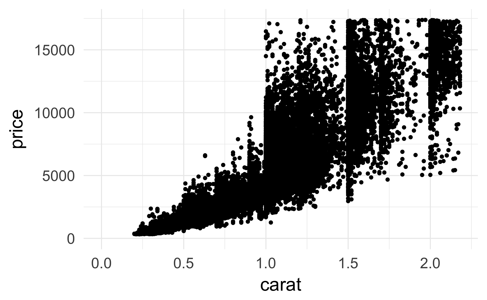
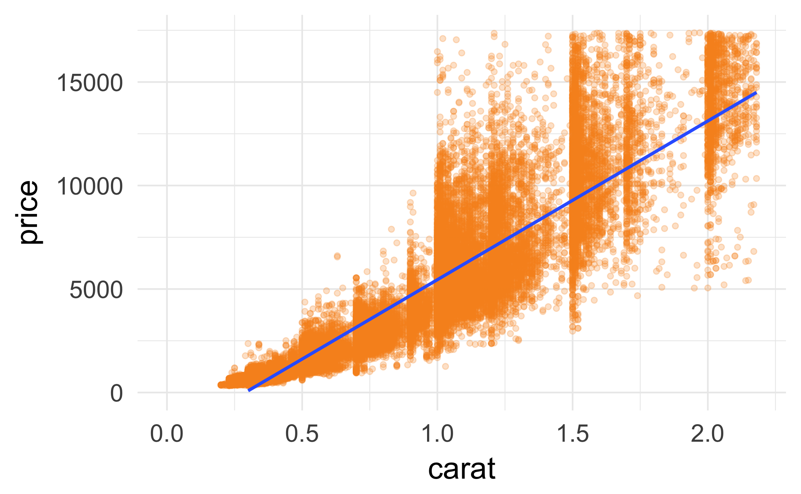
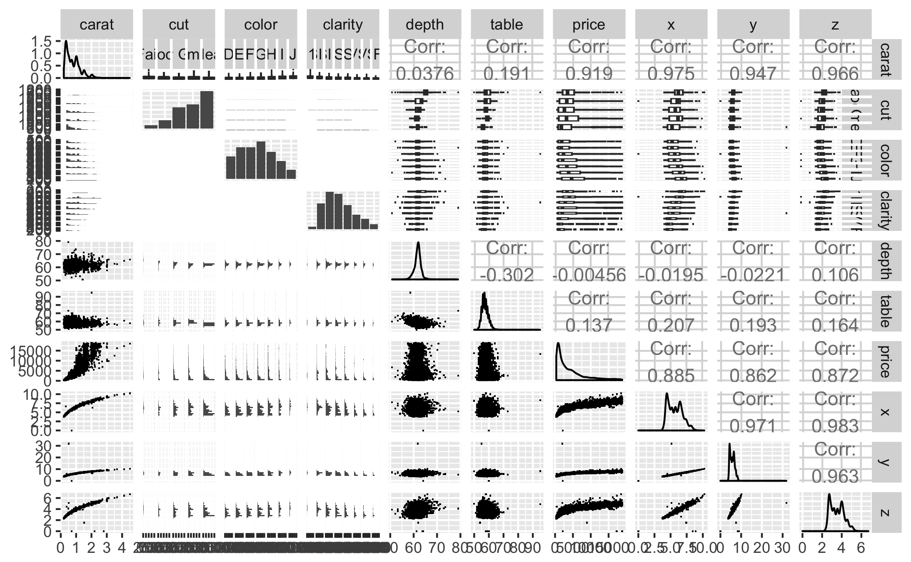
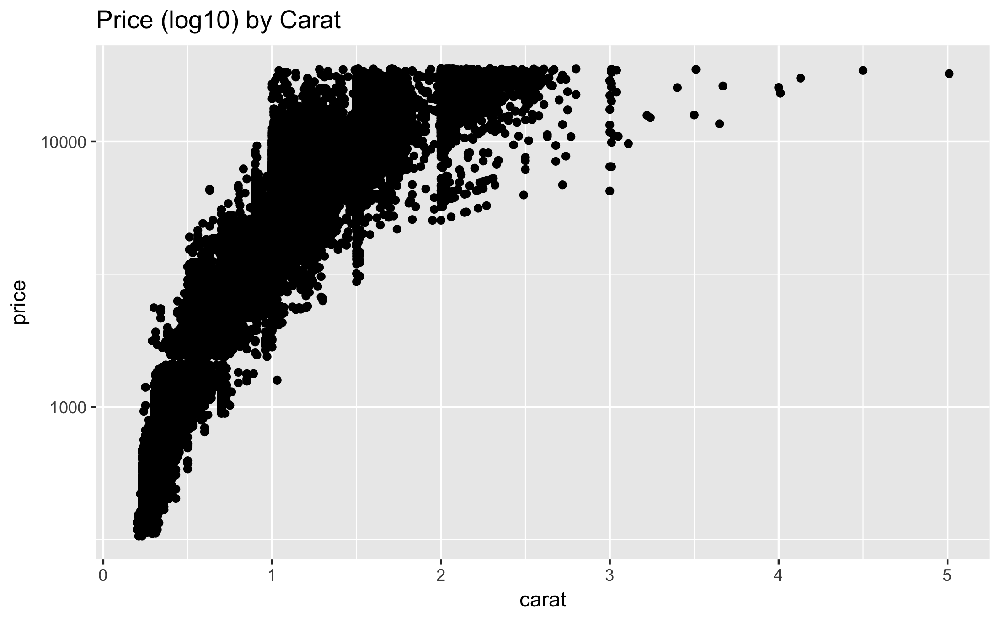
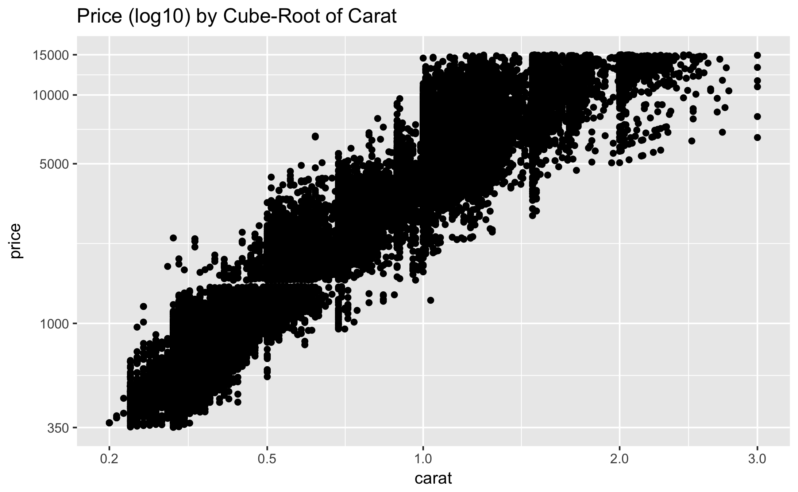
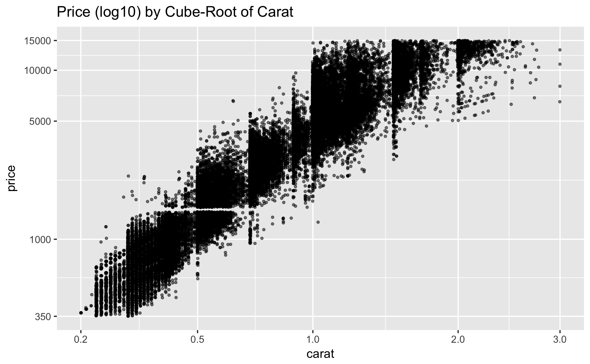
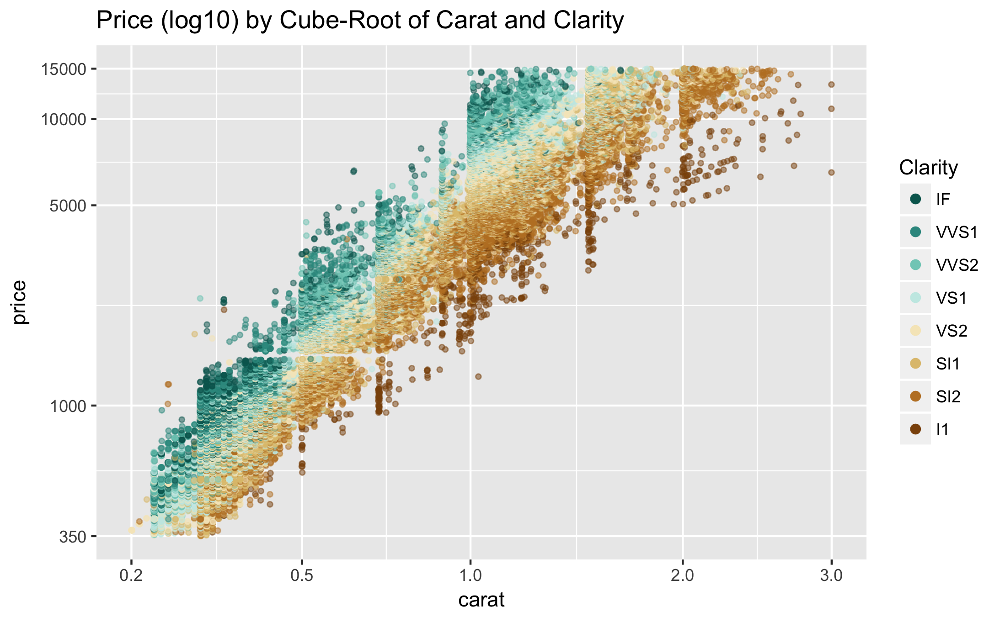
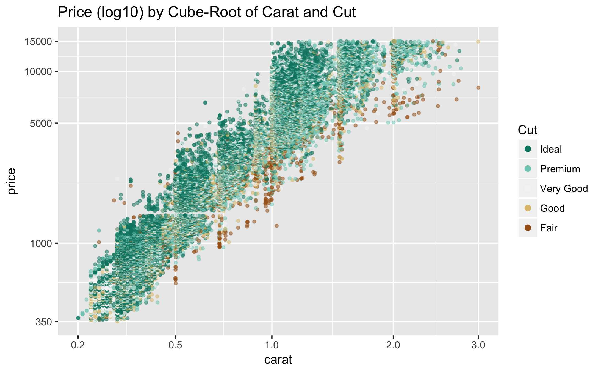
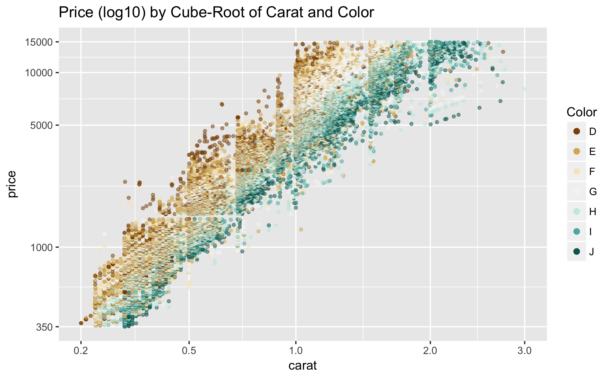

Lesson 6
========================================================

### Welcome
Notes:1、了解钻石市场背后的财富历史，并使用EDA的方法，来获得定量认识；   
2、最终目的是为了建议一个钻石的预测模型，来帮助你判断一个给定的钻石，是很划算，还是在敲竹杠；   
3、探索这个数据集，可帮助你了解钻石价格的成因；

### 线性回归模型

线性回归（Linear regression）是利用称为线性回归方程的最小二乘函数对一个或多个自变量和因变量之间关系进行建模的一种回归分析。

线性回归有很多实际用途。分为以下两大类：
1、如果目标是预测或者映射，线性回归可以用来对观测数据集的和X的值拟合出一个预测模型。当完成这样一个模型以后，对于一个新增的X值，在没有给定与它相配对的y的情况下，可以用这个拟合过的模型预测出一个y值。
2、给定一个变量y和一些变量X1,...,Xp，这些变量有可能与y相关，线性回归分析可以用来量化y与Xj之间相关性的强度，评估出与y不相关的Xj，并识别出哪些Xj的子集包含了关于y的冗余信息。
***

### Scatterplot Review

建立price和carat的散点图，去掉最高的点

```{r Scatterplot Review}
data("diamonds")
ggplot(aes(x = carat, y = price), 
       data = diamonds) + 
  geom_point() + 
  scale_x_continuous(lim = c(0, quantile(diamonds$carat, 0.99))) + 
  scale_y_continuous(lim = c(0, quantile(diamonds$price, 0.99)))

#ggsave("carat_price.png")
```

***

### Price and Carat Relationship
Response:从上图可以看出价格和克拉数之间的关系是：   
1）随着carat增加，price整体呈上升趋势；   
2）同一克拉数，价格区间非常大

我们可以向图中增加一条线性的裁切线，方法是使用统计平滑函数
## Add on Linear Model
```{r}
ggplot(aes(x = carat, y = price), data = diamonds) + 
  geom_point(color = '#F79420', alpha = 1/4) + 
  stat_smooth(method = 'lm') + 
  scale_x_continuous(lim = c(0, quantile(diamonds$carat, 0.99))) + 
  scale_y_continuous(lim = c(0, quantile(diamonds$price, 0.99)))

#ggsave("carat_price_linear.png")
```


从上图可以看到，趋势线在一些关键区域不会穿过数据的中心。在关系的中心应有点弧度，而且应该向尾部更朝上点倾斜，如果我们尝试用这个来做预测，我们可能会在所显示的现有数据内部和外部错过一些关键区域。
***

### Frances Gerety
Notes:对数据集做一个简单的介绍。包含了diamondsc.info在2008年收集的5万多颗钻石。
研究这个数据还是比较有用的，因为钻石和我们使用的其他产品不一样，你没办法根据型号就知道它的价格。

#### A diamonds is forever.


***

### The Rise of Diamonds
Notes:为钻石的发展做了很多策略，成功说服大众。

***

### ggpairs Function
Notes:这个函数绘制每个变量之间的关系图，我们的目标是了解钻石的价格

```{r ggpairs Function}
# install these if necessary
#install.packages('GGally')
#install.packages('scales')
#install.packages('memisc')
#install.packages('lattice')
#install.packages('MASS')
#install.packages('car')
#install.packages('reshape')
#install.packages('plyr')

# load the ggplot graphics package and the others
library(ggplot2)
library(GGally)
library(scales)
library(memisc)

# sample 10,000 diamonds from the data set
set.seed(20022012)
diamond_samp <- diamonds[sample(1:length(diamonds$price), 10000), ]
ggpairs(diamond_samp, 
  lower = list(continuous = wrap("points", shape = I('.'))), 
  upper = list(combo = wrap("box", outlier.shape = I('.'))))
#ggsave("diamonds_ggpairs.png")
```


What are some things you notice in the ggpairs output?
Response:
1、carat-price 基本上呈现指数级增长；
2、price与x、z的关系比较明显，但与其他变量关系并不明显


***

### The Demand of Diamonds
Notes:

```{r The Demand of Diamonds}
library(gridExtra)

plot1 <- ggplot(aes(x = price), data = diamonds) + 
  geom_histogram(binwidth = 100, color = '#099DD9') + 
  ggtitle('Price')

plot2 <- ggplot(aes(x = price), data = diamonds) + 
  geom_histogram(binwidth = 0.01, color = '#F79420') + 
  scale_x_log10() + 
  ggtitle('Price (log10)')

grid.arrange(plot1, plot2, ncol=2)
```

***

### Connecting Demand and Price Distributions
Notes:从上图可以看出两个峰值，可以代表着穷人和富人的消费不同。

***

### Scatterplot Transformation

```{r Scatterplot Transformation}
qplot(carat, price, data = diamonds) + 
  scale_y_continuous(trans = log10_trans()) + 
  ggtitle('Price (log10) by Carat')

#ggsave("carat_price_log10.png")
```


### Create a new function to transform the carat variable

```{r cuberoot transformation}
cuberoot_trans = function() trans_new('cuberoot', transform = function(x) x^(1/3),
                                      inverse = function(x) x^3)
```

#### Use the cuberoot_trans function
```{r Use cuberoot_trans}
ggplot(aes(carat, price), data = diamonds) + 
  geom_point() + 
  scale_x_continuous(trans = cuberoot_trans(), limits = c(0.2, 3),
                     breaks = c(0.2, 0.5, 1, 2, 3)) + 
  scale_y_continuous(trans = log10_trans(), limits = c(350, 15000),
                     breaks = c(350, 1000, 5000, 10000, 15000)) +
  ggtitle('Price (log10) by Cube-Root of Carat')

#ggsave("price_log10_by_cube_root_of_carat.png")
```

***

### Overplotting Revisited

```{r Sort and Head Tables}
head(sort(table(diamonds$carat), decreasing = T))
head(sort(table(diamonds$price), decreasing = T))
```
由于有很多点出现重合的现象，我们可以通过抖动点，或者添加透明度来让点变小些

```{r Overplotting Revisited}
ggplot(aes(carat, price), data = diamonds) + 
  geom_point(alpha = 1/2, size = 3/4, position = "jitter") + 
  scale_x_continuous(trans = cuberoot_trans(), limits = c(0.2, 3),
                     breaks = c(0.2, 0.5, 1, 2, 3)) + 
  scale_y_continuous(trans = log10_trans(), limits = c(350, 15000),
                     breaks = c(350, 1000, 5000, 10000, 15000)) +
  ggtitle('Price (log10) by Cube-Root of Carat')

#ggsave("overplotting_price_carat.png")
```

***

### Other Qualitative Factors
Notes:

***

### Price vs. Carat and Clarity

Alter the code below.
```{r Price vs. Carat and Clarity}
# install and load the RColorBrewer package
#install.packages('RColorBrewer')
library(RColorBrewer)
library(ggplot2)

ggplot(aes(x = carat, y = price, color = clarity), data = diamonds) + 
  geom_point(alpha = 0.5, size = 1, position = 'jitter') +
  scale_color_brewer(type = 'div',
    guide = guide_legend(title = 'Clarity', reverse = T,
    override.aes = list(alpha = 1, size = 2))) +  
  scale_x_continuous(trans = cuberoot_trans(), limits = c(0.2, 3),
    breaks = c(0.2, 0.5, 1, 2, 3)) + 
  scale_y_continuous(trans = log10_trans(), limits = c(350, 15000),
    breaks = c(350, 1000, 5000, 10000, 15000)) +
  ggtitle('Price (log10) by Cube-Root of Carat and Clarity')

#ggsave("price_carat_clarity.png")
```

***

### Clarity and Price
Response:从图中可以看出，净度可以说明价格，当carat一致时，净度越高，价格越高。

***

### Price vs. Carat and Cut

Alter the code below.
```{r Price vs. Carat and Cut}
ggplot(aes(x = carat, y = price, color = cut), data = diamonds) + 
  geom_point(alpha = 0.5, size = 1, position = 'jitter') +
  scale_color_brewer(type = 'div',
                     guide = guide_legend(title = 'Cut', reverse = T,
                                          override.aes = list(alpha = 1, size = 2))) +  
  scale_x_continuous(trans = cuberoot_trans(), limits = c(0.2, 3),
                     breaks = c(0.2, 0.5, 1, 2, 3)) + 
  scale_y_continuous(trans = log10_trans(), limits = c(350, 15000),
                     breaks = c(350, 1000, 5000, 10000, 15000)) +
  ggtitle('Price (log10) by Cube-Root of Carat and Cut')

#ggsave("price_carat_cut.png")
```

***

### Cut and Price
Response:Cut 不影响价格，因为克拉数相同时，不同切工之间价格相差并不明显，而且大多数钻石都是理想切割。

***

### Price vs. Carat and Color

Alter the code below.
```{r Price vs. Carat and Color}
ggplot(aes(x = carat, y = price, color = color), data = diamonds) + 
  geom_point(alpha = 0.5, size = 1, position = 'jitter') +
  scale_color_brewer(type = 'div',
                     guide = guide_legend(title = 'Color', reverse = FALSE,
                                          override.aes = list(alpha = 1, size = 2))) +  
  scale_x_continuous(trans = cuberoot_trans(), limits = c(0.2, 3),
                     breaks = c(0.2, 0.5, 1, 2, 3)) + 
  scale_y_continuous(trans = log10_trans(), limits = c(350, 15000),
                     breaks = c(350, 1000, 5000, 10000, 15000)) +
  ggtitle('Price (log10) by Cube-Root of Carat and Color')

#ggsave("price_carat_color.png")
```

***

### Color and Price
Response:虽然根据专业分析，颜色肉眼识别不出来，但是颜色对价格还是有影响，从图中可以看出，克拉数一致时，颜色越纯净，价格相对越高。

***

### Linear Models in R
Notes: 在r中，我们可以用lm函数创建模型，我们需要按照y~x格式提供一个公式，lm(y~x)，其中y是结果变量，x是解释变量

Response:
我们对长尾变量进行对数变换，我们估计随着钻石数量增加，无瑕疵钻石将呈现指数规律减少，所以我们应该关注克拉重量的立方根。

***

### Building the Linear Model
Notes:下面我们为价格建立线性模型，查看R中的线性模型和运算符：http://data.princeton.edu/R/linearModels.html

```{r Building the Linear Model}
m1 <- lm(I(log(price)) ~ I(carat^(1/3)), data = diamonds)  #第一个模型m1
m2 <- update(m1, ~ . + carat)
m3 <- update(m2, ~ . + cut)
m4 <- update(m3, ~ . + color)
m5 <- update(m4, ~ . + clarity)
mtable(m1, m2, m3, m4, m5)
```

Notice how adding cut to our model does not help explain much of the variance
in the price of diamonds. This fits with out exploration earlier.

***

### Model Problems
Video Notes:

Research:
(Take some time to come up with 2-4 problems for the model)
(You should 10-20 min on this)

Response:
1）近几年的钻石价格s：http://www.pricescope.com/diamond-prices/diamond-prices-chart
   
2）2013年全球钻石报告：http://www.bain.com/publications/articles/global-diamond-report-2013.aspx
   
3）R中的回归系数：http://www.r-bloggers.com/interpreting-regression-coefficient-in-r/?utm_source=feedburner&utm_medium=email&utm_campaign=Feed%3A+RBloggers+%28R+bloggers%29   

4）解释回归系数：http://www.theanalysisfactor.com/interpreting-regression-coefficients/   

5）拟合与解释线性模型：http://blog.yhathq.com/posts/r-lm-summary.html

6）线性模型中因子系数的另一种解释：http://stats.stackexchange.com/a/24256   

***

### A Bigger, Better Data Set
Notes:

```{r A Bigger, Better Data Set}
#install.packages('bitops')
#install.packages('RCurl')
library('bitops')
library('RCurl')

#diamondsurl = getBinaryURL("https://raw.github.com/solomonm/diamonds-data/master/BigDiamonds.Rda")
#load(rawConnection(diamondsurl))

load("BigDiamonds.rda")
```

The code used to obtain the data is available here:
https://github.com/solomonm/diamonds-data

## Building a Model Using the Big Diamonds Data Set
Notes:

```{r Building a Model Using the Big Diamonds Data Set}
names(diamondsbig)

m1 <- lm(I(log(price)) ~ I(carat^(1/3)), data = diamondsbig)  #第一个模型m1
m2 <- update(m1, ~ . + carat)
m3 <- update(m2, ~ . + cut)
m4 <- update(m3, ~ . + color)
m5 <- update(m4, ~ . + clarity)
mtable(m1, m2, m3, m4, m5)
```


***

## Predictions

Example Diamond from BlueNile:
Round 1.00 Very Good I VS1 $5,601

```{r}
#Be sure you’ve loaded the library memisc and have m5 saved as an object in your workspace.
thisDiamond = data.frame(carat = 1.00, cut = "V.Good",
                         color = "I", clarity="VS1")
modelEstimate = predict(m5, newdata = thisDiamond,
                        interval="prediction", level = .95)

exp(modelEstimate)
```

Evaluate how well the model predicts the BlueNile diamond's price. Think about the fitted point estimate as well as the 95% CI.

***

## Final Thoughts
Notes:

***

Click **KnitHTML** to see all of your hard work and to have an html
page of this lesson, your answers, and your notes!

